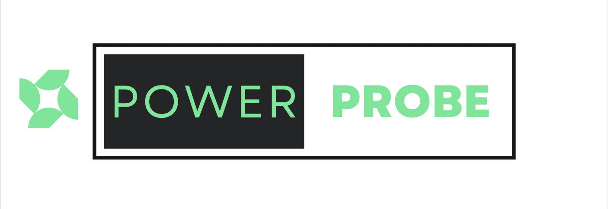
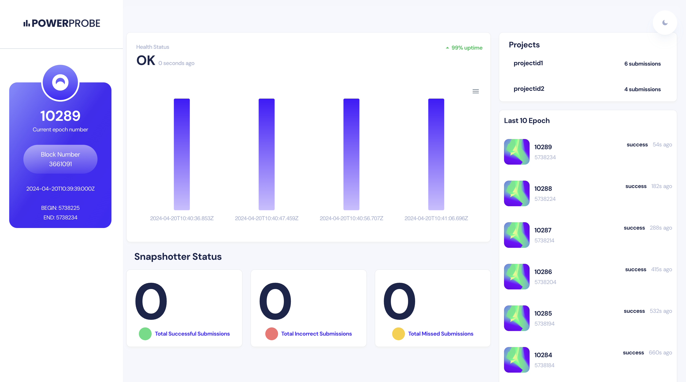

<br>



# Power Probe

## Description
Power Probe leverages Power Loom nodes for performance metric tracking, presenting intuitive analytics through a user-friendly dashboard. Utilizing ReactJS, our dashboard elegantly displays snapshotter node stats, offering users comprehensive insights at a glance.

<br>

## Demo

### Home Page



<br>

Github : <a style="margin-bottom: 5px;" href="https://github.com/Novobloc/power-probe" target="_blank"> Repo Link </a>

Video : <a style="margin-bottom: 5px;" href="put the video like here" target="_blank"> Youtube Link </a>

## Stack We Used

1. React JS
2. PowerLoom Snapshotter Node
3. Eth Sepolia Chain

## Steps to Run Snapshotter Node

1. **Clone the repository against the devnet branch.**

   ```bash
   git clone https://github.com/PowerLoom/deploy.git --single-branch powerloom_deploy --branch devnet && cd powerloom_deploy
   ```

2. **Visit [devnet-mint.powerloom.dev](https://devnet-mint.powerloom.dev) to begin the minting process.**

   - Connect your wallet.
   - Click on "mint".
   - After minting, copy the slot ID provided and add it to your environment variables in step 3.

3. **Copy `env.example` to `.env`.**

   Ensure the following required variables are filled:

   - `SOURCE_RPC_URL`: The URL for Ethereum RPC (Local node/Infura/Alchemy) service.
   - `SIGNER_ACCOUNT_ADDRESS`: The address of the signer account. This is your whitelisted address on the protocol. **Using a burner account is highly recommended.**
     Get a burner account from [here](https://devnet-mint.powerloom.dev/burner).
   - `SLOT_ID`: The NFT ID of your minted devnet NFT.
   - `SIGNER_ACCOUNT_PRIVATE_KEY`: The private key corresponding to the signer account address.
   - Configure `SNAPSHOT_CONFIG_REPO` and `SNAPSHOT_CONFIG_REPO_BRANCH` to point to your forked snapshotter-configs repository.
   - Configure `SNAPSHOTTER_COMPUTE_REPO` and `SNAPSHOTTER_COMPUTE_REPO_BRANCH` to point to your forked snapshotter-computes repository.
   - `PROST_RPC_URL`: The URL for the PROST RPC service.
   - `PROTOCOL_STATE_CONTRACT`: The contract address for the protocol state.
   - `RELAYER_HOST`: The host address for the relayer.
   - `NAMESPACE`: The unique key used to identify your project namespace around which all consensus activity takes place.
   - `POWERLOOM_REPORTING_URL`: The URL for reporting to PowerLoom.
   - `PROST_CHAIN_ID`: The chain ID for the PROST RPC service.

4. **Setup codebase by running `bootstrap.sh` using `./bootstrap.sh` command.**

   - **Note:** This is a one-time step and resets the codebase to the latest version of the branch. If you have made any changes to the codebase, make sure to commit them before running this command. You need to run this command only once after cloning the repository.

5. **Install required dependencies for python scripts by running `pip install -r requirements.txt` command.**

6. **Run the node using the command `./build.sh`.**

7. **Assign Burner wallet.**

   ```
   Do you want to assign a burner wallet to a slot? (yes/no):
   ```

   Click yes.

8. **Enter your private key which you used to mint in dashboard.**

   ```
   To assign a burner wallet to a slot, you need to sign a message with the private key of the Account holding the slot.
   Private Key:
   ```

## Steps to Run the Project

1. Clone the repos

```
git clone https://github.com/Novobloc/power-probe
```

2. Install the dependencies.

```
 yarn
```

3. Start the app using command

```
yarn start
```

4. Open this link in browser http://localhost:3000

5. Hey, You just ran the code in your system, thats it.

<br>

## Meet Our Team

<div style="display: flex; justify-content: space-between; align-items: center;">
   <p style="flex:1">Shiva Kumar: </p>
   <div style="flex:4; justify-content: space-between;">
      <a href="https://www.linkedin.com/in/shivamangina/" target="_blank">
      
      </a>
      <a href="https://twitter.com/shivakmangina" target="_blank">
      
      </a>
      <a href="https://www.instagram.com/shiva_mangina" target="_blank">
      
      </a>
      <a href="https://github.com/shivamangina" target="_blank">
      
      </a>
   </div>
</div>

<div style="display: flex; justify-content: space-between; align-items: center;">
   <p style="flex:1">Sandeep Kumar: </p>
   <div style="flex:4; justify-content: space-between;">
      <a href="https://www.linkedin.com/in/satyasandeep" target="_blank">
      
      </a>
      <a href="https://twitter.com/satyasandeep76" target="_blank">
      
      </a>
      <a href="https://www.instagram.com/satyasandeep007" target="_blank">
      
      </a>
      <a href="https://github.com/satyasandeep007" target="_blank">
      
      </a>
   </div>
</div>
